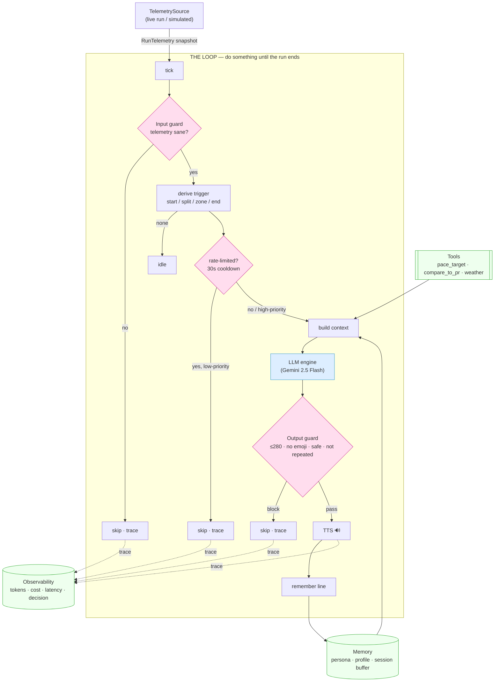

# RunCoachHarness — Architecture

A standalone agent **harness** that turns live run telemetry into spoken, in-character
coaching. The harness is the *car*; the LLM is just the *engine*. Everything that makes
the model useful and safe lives in the six pillars below.

> Built on an existing in-app AI running coach, lifted out of the iOS app into a clean,
> observable, standalone loop. The app becomes one telemetry adapter, not the whole system.

---

## One-line summary

> A live running coach: on every tick of run telemetry, the harness decides **whether**
> to speak and **what** to say — in the user's chosen coach persona — guarded for safety
> and brevity, and fully instrumented for tokens, cost, and latency.

---

## The six pillars

```
                          ┌─────────────────────────────────────────────┐
   LIVE RUN               │                  THE LOOP                     │
   (TelemetrySource)      │   tick → derive trigger → decide → speak      │
        │                 │                                               │
        │  RunTelemetry    │   ┌──────────┐   ┌──────────┐   ┌──────────┐ │
        ├────────────────▶│   │ GUARDRAIL│   │  MEMORY   │   │  TOOLS   │ │
        │  (pace, dist,    │   │  (input) │   │ (context) │   │ (lookups)│ │
        │   HR, splits,    │   └────┬─────┘   └────┬─────┘   └────┬─────┘ │
        │   goal, zone)    │        └──── build context ──────────┘       │
        │                 │                    │                          │
        │                 │              ┌─────▼─────┐                    │
        │                 │              │    LLM    │  (Gemini 2.5 Flash)│
        │                 │              │  (engine) │                    │
        │                 │              └─────┬─────┘                    │
        │                 │              ┌─────▼─────┐                    │
        │                 │              │ GUARDRAIL │  (output: ≤280 ch, │
        │                 │              │  (output) │   on-persona, safe)│
        │                 │              └─────┬─────┘                    │
        │                 │              ┌─────▼─────┐                    │
        │                 │              │    TTS    │ ──▶ 🔊 spoken line  │
        │                 │              └───────────┘                    │
        │                 │                                               │
        │                 │   every tick ▶ OBSERVABILITY                  │
        │                 │   (trigger, decision, tokens, cost, latency)  │
        │                 └─────────────────────────────────────────────┘
```

### Data flow (rendered)



### 1. LLM — the engine
- **Stateless.** Text in, text out. Knows nothing on its own.
- Model: **Gemini 2.5 Flash** (parity with the production app).
- Abstracted behind an `LLMClient` protocol so a deterministic mock can drive
  offline demos; the Gemini client parses `usageMetadata` for real token counts.

### 2. Memory — everything that is *not* the LLM
The harness assembles a context object on every speak-decision:
- **Coach persona** — built-in (motivational / calm-zen / drill-sergeant / friendly-pacer)
  or a **user-authored custom coach** (name, voice, free-text instructions). This is the
  customization surface.
- **Persistent run journal** — past runs (distance, pace, best split, notes like "faded on
  the final hill") stored across launches in `RunJournal`. The runner **profile is derived
  from it** (not hardcoded), and the agentic loop writes each finished run back, so the coach
  accumulates knowledge over time. The model retrieves from it via the `recall_past_runs` tool.
- **Session buffer** — the last 6 lines the coach already said this run, so it does not
  repeat openers or hooks. ("Vary your angle.")
- **Current telemetry** — the live snapshot for this tick.

### 3. The Loop — "do something *until*"
- Consumes `RunTelemetry` snapshots from a `TelemetrySource`.
- **Derives a trigger** by diffing consecutive snapshots: first snapshot → `runStart`;
  `completedSplits` increased → `splitCompleted`; `heartRateZone` changed →
  `heartRateZoneChange`; stream ends / goal reached → `runEnd`.
- **Halt condition:** the run finishes (telemetry `isFinished`) or the stream completes.
- **Decider / brakes:** a 30s rate-limit cooldown between utterances (bypassed by
  high-priority moments: start, end, cheers, user questions) — this is the "bumper" that
  prevents a runaway, chatty loop.

### 4. Tools — anything the harness controls
- Documented, schema-described helpers the coach can draw on, e.g.
  `pace_target` (what pace hits the goal from here), `compare_to_pr` (is this split a PR?),
  `weather` (conditions for pacing/hydration advice).
- **The documentation is for the model** — the schema/description is how it knows when a
  tool is relevant. Schemas are surfaced in the trace for observability.

### 5. Guardrails — bumper bowling
- **Input guard:** sanity-check telemetry before acting (implausible pace/HR, GPS dropout)
  so the coach never reacts to garbage.
- **Output guard:** enforce the brand/safety contract before anything is spoken —
  ≤ 280 characters, no emojis/hashtags, strip the internal `[playful]` control token,
  reject medical claims, reject near-duplicates of recent lines. Can escalate to a second
  LLM pass if a line looks off.

### 6. Observability — "if you can't see it, you can't fix it"
Every tick emits a structured trace record:
- which **trigger** fired,
- the **decision** (`spoke` / `skipped: rate-limited` / `skipped: guardrail`),
- **tokens** (prompt + output, from Gemini `usageMetadata`),
- **cost** (tokens × 2.5-Flash rate),
- **latency** (model round-trip),
- the **text** delivered.

Emitted as JSON-lines + a live console panel; running totals for tokens/cost/latency at
run end. This is also the demo's "wow" surface — judges watch the coach think tick-by-tick.

---

## The live bridge (key design decision)

Telemetry enters through a single protocol:

```swift
protocol TelemetrySource {
    func stream() -> AsyncStream<RunTelemetry>
}
```

- **Demo:** a `SimulatedRun` source (and JSONL replay) — runs anywhere, even on bad
  conference wifi, deterministic for judging.
- **Production:** the app conforms its real location / heart-rate / run services to the
  same protocol → the existing app becomes a live telemetry adapter with **zero changes to
  the harness**. One harness, many sources.

## Goals

A run targets a `RunGoal` — `.distance(meters:)`, `.time(seconds:)`, or `.free`. The goal flows
into `RunTelemetry` (`goalType` + `goalTargetMeters` / `goalTargetSeconds`), and `goalProgress`
computes fractional completion for **distance and time**. The coach sees the goal and progress
in its context, so it adds final-stretch urgency near a target and none on a free run. Both
`SimulatedRun` and the live-GPS source honor the goal; the demo app's goal picker sets it.

---

## Module map

| File | Pillar | Responsibility |
|------|--------|----------------|
| `Telemetry.swift` | (input) | `RunTelemetry` snapshot, `CoachingTrigger`, `TelemetrySource` protocol, `RunGoal` (distance / time / free) |
| `LLM.swift` | LLM | `LLMClient` protocol, `GeminiClient` (REST + usage), `MockLLMClient` |
| `Memory.swift` | Memory | persona + profile + rolling session buffer → context assembly |
| `Personas.swift` | Memory | built-in personas + custom-coach model |
| `Journal/RunJournal.swift` | Memory | **persistent** cross-run journal, relevance recall, profile derivation |
| `CoachLoop.swift` | Loop | deterministic: tick → trigger → one completion → speak → record |
| `Agentic/CoachAgent.swift` | LLM+Loop | `CoachAgent` protocol, `AgentOutcome`, offline `MockAgent` |
| `Agentic/GeminiAgent.swift` | LLM+Loop | real Gemini **function-calling**: reason → call tool → observe → repeat |
| `Agentic/AgenticCoachLoop.swift` | Loop | model-driven: gate → agent decides (speak/silent + tools) → critic → speak |
| `Agentic/AgentTool.swift` | Tools | model-callable tools incl. `recall_past_runs` (a real, argument-taking tool) |
| `Tools.swift` | Tools | `CoachTool` protocol + sample context tools (deterministic loop) |
| `Guardrails.swift` | Guardrails | input sanity + output safety/brevity/anti-repeat |
| `Guardrails+Critic.swift` | Guardrails | `OutputCritic` — optional second-opinion LLM review (the cascade tier) |
| `Observability.swift` | Observability | `CoachTrace` (+ tool-call trail), `Tracer`, token/cost/latency tallies |
| `TTS.swift` | (output) | `SpeechOutput` protocol + console/`say` sinks |
| `Voices.swift` | (output) | `GeminiVoice` catalog — TTS voice names for coach customization |
| `Sources/coachd/main.swift` | — | CLI demo: `--agentic` runs the model-driven loop |

---

## Two loops, on purpose

There are **two** loop implementations, and the choice is a real engineering tradeoff:

- **`CoachLoop` (deterministic)** — one LLM completion per coaching moment. Predictable
  latency and cost; the *code* assembles context and decides when to speak. This is the
  better **product** for a real-time, on-phone coach.
- **`AgenticCoachLoop` (model-driven)** — a cheap deterministic gate still picks *candidate*
  moments (cost control), but at each candidate the **model** decides: call tools, then speak
  or `stay_silent`. The `recall_past_runs` tool fetches journal history the model doesn't
  otherwise have, so Memory + Tools + Loop compose rather than act as ceremony. This is the
  better **demonstration of agency**.

The agent's tool-call trail and the critic verdict both show up in observability.

## Validated against the live API

The full Gemini paths were exercised against the real `generativelanguage.googleapis.com`
endpoint and returned 200:

- **Text generation** (deterministic engine, critic, coach preview),
- **TTS** (`gemini-2.5-flash-preview-tts`) — returns `audio/L16;codec=pcm;rate=24000`, which the
  app wraps as WAV and plays,
- **Function-calling round trip** — `functionCall` → tool result returned as a
  `functionResponse` with `role:"user"` → final coaching line. This confirms `GeminiAgent`'s
  wire format.

## Honest limitations

- **Recall is keyword + recency**, not embeddings — fine for a few dozen runs, not for years
  of history.
- **The deterministic guardrails are string/length checks**; the `LLMOutputCritic` adds a real
  second opinion but is fail-open (it won't silence the coach if it errors).
- **Per-moment cost/latency in the agentic loop is higher** than the deterministic loop (one
  or more extra round trips when the model calls tools) — the cheap gate keeps it bounded, but
  it is the tradeoff for real agency.

---

## Demo flow

1. `swift run coachd` (uses `MockLLMClient` by default; set `GEMINI_API_KEY` for the real engine).
2. `SimulatedRun` streams a ~5K run on an accelerated clock.
3. The loop speaks on start, each km split, HR-zone changes, and the finish — in the
   selected persona.
4. A live observability panel prints trigger / decision / tokens / cost / latency per tick,
   with run-end totals.
